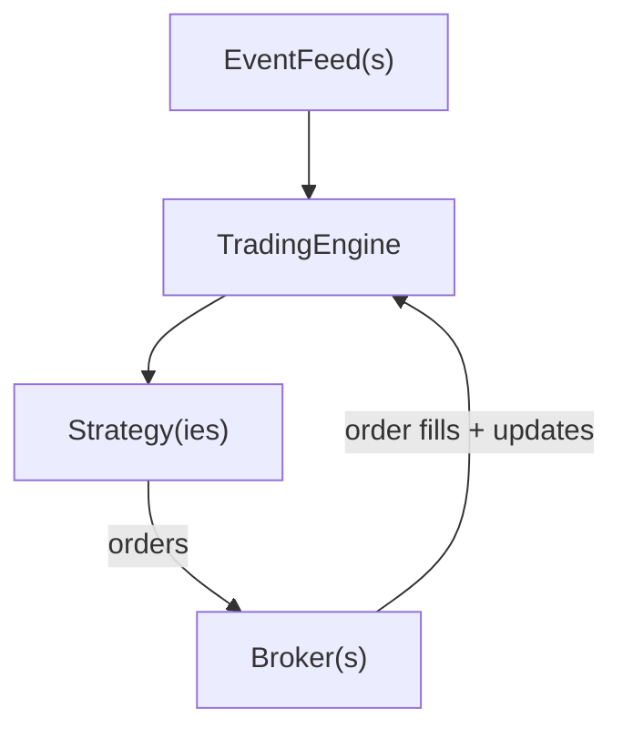

# SUITE Trading

SUITE Trading is a modern Python framework for algorithmic trading, which provides a unified, event-driven architecture for backtesting, paper trading and live trading. It is designed to make you productive quickly.

SUITE stands for: **S**imple, **U**nderstandable, **I**ntuitive **T**rading **E**ngine

[](https://deepwiki.com/stefansimik/suite_trading)

> Work in progress: SUITE Trading is under active development. Breaking changes may happen while the API stabilizes.

## Key features / Why SUITE Trading?

SUITE Trading is built for traders who want a framework that stays out of the way: simple objects, explicit wiring, and realistic simulation.

- **One codebase, multiple modes**: Same strategy code runs in backtesting, paper trading, and live trading
- **Shared timeline simulation (portfolio realism)**: Multiple strategies execute together on a single unified clock for realistic portfolio backtests; the engine guarantees deterministic, correct chronological ordering (no cross-strategy look-ahead).
- **Simple, intuitive API**: Domain model matches how traders think—no complex abstractions or hidden layers. Simple intuitive inspectable domain model, where types like `Order`, `Position`, `Bar` and `OrderBook` behave as you expect and are easy to debug.
- **Smart components with clear jobs**: `TradingEngine` runs time and routes events, `Strategy` holds your logic, `Broker` manages one account and `EventFeed` brings in data.
- **Explicit and easy to follow**: You can see where data comes from and where orders go. When something happens,
  you can follow it in the code.
- **Production-grade simulation building blocks**: `SimBroker` supports MARKET, LIMIT, STOP, and STOP_LIMIT orders,
  plus margin, fees, slippage and customizable liquidity.
- **Extensible by design**: Plug in new data sources, broker adapters and event types with minimal boilerplate
- **Productivity utilities**: Data generation assistant, datetime helpers, state machine utilities, ...
- **Modern Python**: Typed Python 3.13+ codebase for strong IDE support and safe refactors.

 

---

## Table of Contents

- [Key features / Why SUITE Trading?](#key-features--why-suite-trading)
- [Getting started](#getting-started)
  - [Prerequisites](#prerequisites)
  - [Installation](#installation)
  - [Verify your installation](#verify-your-installation)
  - [Minimal strategy example](#minimal-strategy-example)
- [Core concepts](#core-concepts)
- [Architecture overview](#architecture-overview)
- [Extending the framework (recipes)](#extending-the-framework-recipes)
- [Roadmap](#roadmap)
- [Project info](#project-info)
- [Contributing](#contributing)
- [License](#license)
- [Disclaimer](#disclaimer)

---

## Getting started

### Prerequisites

- **Python 3.13.x**
- **uv** package manager (recommended; see `pyproject.toml`)
- Git (to clone the repository)

SUITE Trading runs on macOS, Linux, and Windows.

### Installation

```bash
git clone https://github.com/stefansimik/suite_trading
cd suite_trading
uv sync
```

### Verify your installation

These small end-to-end integration tests are the quickest way to confirm your Python + dependencies are wired
correctly.

```bash
uv run pytest tests/integration/test_basic_flow.py -v
```

If you do not use `uv`, you can run the same tests with:

```bash
python -m pytest tests/integration/test_basic_flow.py -v
```

If you want a slightly richer demo that also submits orders to `SimBroker`:

```bash
uv run pytest tests/integration/test_two_trade_demo_strategy.py -v
```

If you prefer to run the full test suite:

```bash
uv run pytest
```

### Minimal strategy example

This Strategy buys on the first bar, then closes the position exactly 5 bars later.
The data is intentionally synthetic so you can run it anywhere.

```python
from __future__ import annotations

import logging
from decimal import Decimal

from suite_trading.domain.market_data.bar.bar import Bar
from suite_trading.domain.market_data.bar.bar_event import BarEvent, wrap_bars_to_events
from suite_trading.domain.order.order_enums import OrderSide
from suite_trading.domain.order.orders import MarketOrder
from suite_trading.platform.broker.broker import Broker
from suite_trading.platform.broker.sim.sim_broker import SimBroker
from suite_trading.platform.engine.trading_engine import TradingEngine
from suite_trading.platform.event_feed.fixed_sequence_event_feed import FixedSequenceEventFeed
from suite_trading.strategy.strategy import Strategy
from suite_trading.utils.data_generation.assistant import DGA


logger = logging.getLogger(__name__)


class DemoStrategy(Strategy):
    """Buys on the first bar and sells 5 bars later."""

    def __init__(self, name: str, broker: Broker) -> None:
        super().__init__(name)
        self._broker = broker
        # State
        self._bar_count = 0
        self._is_entry_submitted = False

    # This function is called once when the Strategy is started
    def on_start(self) -> None:
        # Create 20 synthetic demo bars
        bars = DGA.bars.create_bar_series(num_bars=20)

        # Create an EventFeed from the bars
        bars_event_feed = FixedSequenceEventFeed(wrap_bars_to_events(bars))

        # Add the EventFeed to this Strategy (these bars drive order simulation)
        self.add_event_feed("bars", bars_event_feed, use_for_simulated_fills=True)

    # This function receives all events (data) coming to strategy
    def on_event(self, event: object) -> None:
        # If event is BarEvent, then delegate it
        if isinstance(event, BarEvent):
            self.on_bar(event.bar)

    # This function receives all BarEvents from the EventFeed
    def on_bar(self, bar: Bar) -> None:
        # Count bars so we can act on bar #1 and bar #6
        self._bar_count += 1

        # On 1st bar + if entry order was not submitted yet
        if self._bar_count == 1 and not self._is_entry_submitted:
            # Create and submit market order (open position)
            order = MarketOrder(instrument=bar.instrument, side=OrderSide.BUY, quantity=Decimal("1"))
            self.submit_order(order, self._broker)
            # Mark entry order as submitted
            self._is_entry_submitted = True
            logger.info(f"Opened position on bar #{self._bar_count} at close price {bar.close}")
            return

        # On 6th bar + if entry order was submitted
        if self._bar_count == 6 and self._is_entry_submitted:
            # Create and submit market order (close position)
            order = MarketOrder(instrument=bar.instrument, side=OrderSide.SELL, quantity=Decimal("1"))
            self.submit_order(order, self._broker)
            logger.info(f"Closed position on bar #{self._bar_count} at close price {bar.close}")

    # This function is called once when the Strategy is stopped
    def on_stop(self) -> None:
        logger.info(f"Strategy finished after {self._bar_count} bars")


def run() -> None:
    # Engine is main orchestrator
    engine = TradingEngine()

    # Create broker and add it to engine
    sim_broker = SimBroker()
    engine.add_broker("sim", sim_broker)

    # Create strategy and add it to engine
    strategy = DemoStrategy(name="demo_strategy", broker=sim_broker)
    engine.add_strategy(strategy)

    # Start processing
    engine.start()


if __name__ == "__main__":
    run()
```

What happens step by step:

1. `TradingEngine` starts and runs one shared timeline.
2. `on_start()` creates a synthetic bar series and attaches it as an `EventFeed`.
3. On bar #1, the Strategy submits a BUY `MarketOrder` (to the chosen `Broker`) to open a position.
4. On bar #6, the Strategy submits a SELL `MarketOrder` (to the same `Broker`) to close the position.
5. Remaining bars from EventFeed arrive to the Strategy and are processed in order
6. Once all 20 bars are processed, the Strategy stops and the engine shuts down automatically.
7. Everything was done.

---

## Core concepts

### `TradingEngine`

Think of `TradingEngine` as the container that wires your `Strategy`(ies), `Broker`(s), and `EventFeed`(s)
together.
It runs the main loop and makes sure all strategies see events on one shared timeline (one global chronological
order).

Why this matters: if you run Strategy A and Strategy B together, neither strategy should see "future" events relative
to the other.

What it owns:

- all registered `Strategy` instances
- all registered `Broker` instances
- the global simulated timeline (`current_engine_dt`)
- event routing and execution tracking

### `Strategy`

`Strategy` is where your trading logic lives.
It receives `Event` objects via `on_event(event)` and can submit orders to any connected `Broker`.

Common callbacks:

- `on_start()` to wire event-feeds
- `on_event(event)` as your main data callback
- `on_stop()` for cleanup
- `on_error(error)` for error handling

### `Broker` and `SimBroker`

`Broker` is a single-account interface that the whole codebase uses.
`SimBroker` is one implementation of that interface for backtests and paper trading.
Because Strategies talk to the `Broker` interface, swapping a simulated broker for a live broker adapter is
intentionally simple.

One broker instance represents exactly one logical trading account.
Multiple accounts are modelled by multiple broker instances registered into `TradingEngine`.

`SimBroker` simulates fills using the "last price" from incoming market data (for example, bars) and emits
executions back to the engine.

### `EventFeed`

`EventFeed` is how data enters a Strategy.
It can represent anything: historical bars, synthetic test data, or live market data.
It produces time-ordered `Event` objects.

Common methods:

- `peek()` to inspect the next event without consuming it
- `pop()` to consume the next event
- `remove_events_before(cutoff)` to skip past events (used for timeline sync)

### `Event`

An `Event` is a wrapper for "something that happened at a time".
It carries timestamps and a payload (bar, tick, order book, custom data, ...).

---

## Architecture overview

SUITE Trading uses an **event-driven architecture** where all external market data flows through timestamped `Event`
objects.

High-level data flow:



Event ordering:

- Primary sort is by `dt_event` (when it happened in the market).
- Secondary sort is by `dt_received` (when it entered the system), which makes ordering deterministic when two events
  share the same market timestamp.

---

## Extending the framework (recipes)

### Add a new `EventFeed`

If you have data coming from anywhere (CSV, Parquet, a database, a websocket, your own API), you can plug it in by
implementing an `EventFeed`.

In practice:

1. Implement the `EventFeed` protocol (`peek()`, `pop()`, `is_finished()`, `close()`).
2. Convert your raw inputs into domain payloads (bars, ticks, order books, or your own objects).
3. Wrap them into time-ordered `Event` objects.
4. Attach the feed in `Strategy.on_start()` via `add_event_feed(...)`.

### Add a new `Broker`

To trade live, create a broker adapter by implementing the `Broker` protocol for your venue.

Then register it in `TradingEngine` and use it from your Strategy:

1. Create your broker instance.
2. Call `engine.add_broker("my_broker", my_broker)`.

That's it: your Strategies can now submit orders to your new broker the same way they submit orders to `SimBroker`.

### Add new event types

If your Strategy needs a custom kind of input (for example: news sentiment, funding rates, on-chain metrics), just model it
as an `Event` and deliver it via an `EventFeed`.

In practice:

1. Decide what your event payload should be (your own object, or a domain model).
2. Wrap it into an `Event` with the right timestamps.
3. Emit it from your `EventFeed` and handle it in `Strategy.on_event`.

---

## Roadmap

Roadmap last updated: `2025-12-17`

SUITE Trading is in active development with approximately **70% of core functionality** implemented.

| Status | Area         | Work item |
|:-------|:-------------|:---------|
| ✅      | Core         | Event-driven architecture with chronological processing. Stable event ordering on the shared timeline. |
| ✅      | Core         | TradingEngine with multi-strategy management. Deterministic processing across Strategy(ies). |
| ✅      | Strategy     | Strategy framework (on_start, on_stop, on_error, on_event). Core lifecycle and event routing. |
| ✅      | Domain       | Domain models: Event, Bar, Order, Instrument, Money, Position, Account. Core trading and market-data objects. |
| ✅      | Data         | EventFeed system with timeline filtering. Skip/trim past events to keep the timeline in sync. |
| ✅      | Simulation   | SimBroker order lifecycle (MARKET/LIMIT/STOP/STOP_LIMIT; cancel/modify). Base simulation in place; improving. |
| ✅      | Core         | MessageBus with topic-based routing and wildcards. Internal event routing backbone. |
| ✅      | Simulation   | Event → OrderBook conversion for order matching. Enables matching against order book snapshots. |
| ✅      | Accounting   | Per-instrument position tracking. Core position state per instrument. |
| ✅      | Reporting    | Per-strategy execution history. Raw execution data captured per Strategy. |
| ✅      | Productivity | Data generation utilities for testing. Synthetic fixtures for fast iteration. |
| ✅      | Simulation   | SimBroker realism layer (margin, fees, slippage, liquidity). Expand fill models and overall realism. |
| ✅      | Simulation   | Time-in-force semantics in SimBroker (IOC, FOK, DAY, GTD, GTC). Add TimeInForce rules; model GTD datetime if needed. |
| 🗓️    | Accounting   | Account correctness review (cash, margin, position lifecycle). Audit and tighten Account / SimAccount invariants. (Timeline: TBD) |
| 🗓️    | Orders       | Order relationships (OCO; define OUO semantics). Implement OCO first; specify OUO before adding more relationships. (Timeline: TBD) |
| 🗓️    | Orders       | OrderBuilder (safe, ergonomic order creation). Reduce boilerplate and centralize validation. (Timeline: TBD) |
| 🗓️    | Data         | CSV/Parquet event-feeds. High-performance data loading for backtests. (Timeline: Q2 2026) |
| 🗓️    | Indicators   | Indicators framework (SMA, EMA, RSI, MACD, ...). Common indicator set and clean Strategy API. (Timeline: TBD) |
| 🗓️    | Reporting    | Performance statistics per Strategy + backtest reports. Build metrics from executions/positions (portfolio analytics later). (Timeline: TBD) |
| 🗓️    | UI           | Streamlit export (bars, executions, equity curve, results). Export-friendly data for visualization. (Timeline: TBD) |
| 🗓️    | UI           | Dashboard. Monitoring and controls (local-first). (Timeline: Q4 2026) |
| 🗓️    | Strategy     | Strategy regression / extensibility review. Add more scenarios; consider plugins only if it reduces duplication. (Timeline: TBD) |
| 🗓️    | Live         | First live broker adapter: Interactive Brokers (IBKR). First real-money integration (single-account Broker adapter). (Timeline: Q3 2026) |

Legend:

- ✅ **Done**
- 🚧 **In progress**
- 🗓️ **Planned**

---

## Project info

- **Version**: 0.0.1 (alpha).
- APIs may change; breaking changes are allowed while the design stabilizes.

---

### Contributing

1. Open an issue with what you want to change and why.
2. Keep PRs small and focused.
3. Add tests where behavior matters.

### License

- MIT License.
- See the `LICENSE` file for details.

### Disclaimer

* This project is for educational and research purposes only.
* It is not financial advice.
* Trading involves risk and you can lose money.
