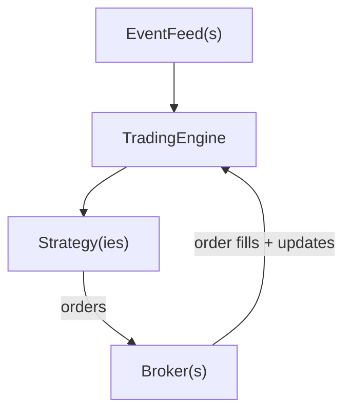
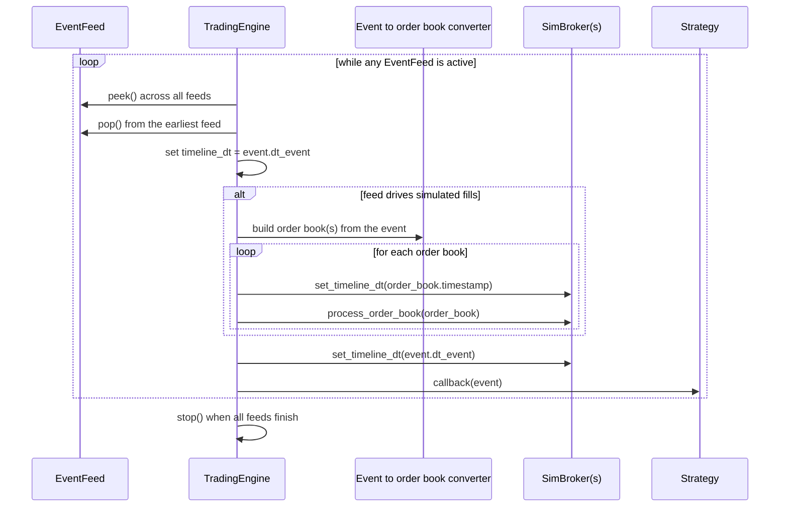
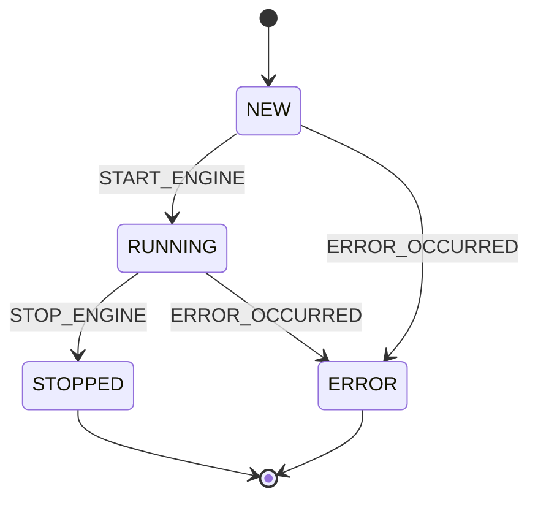
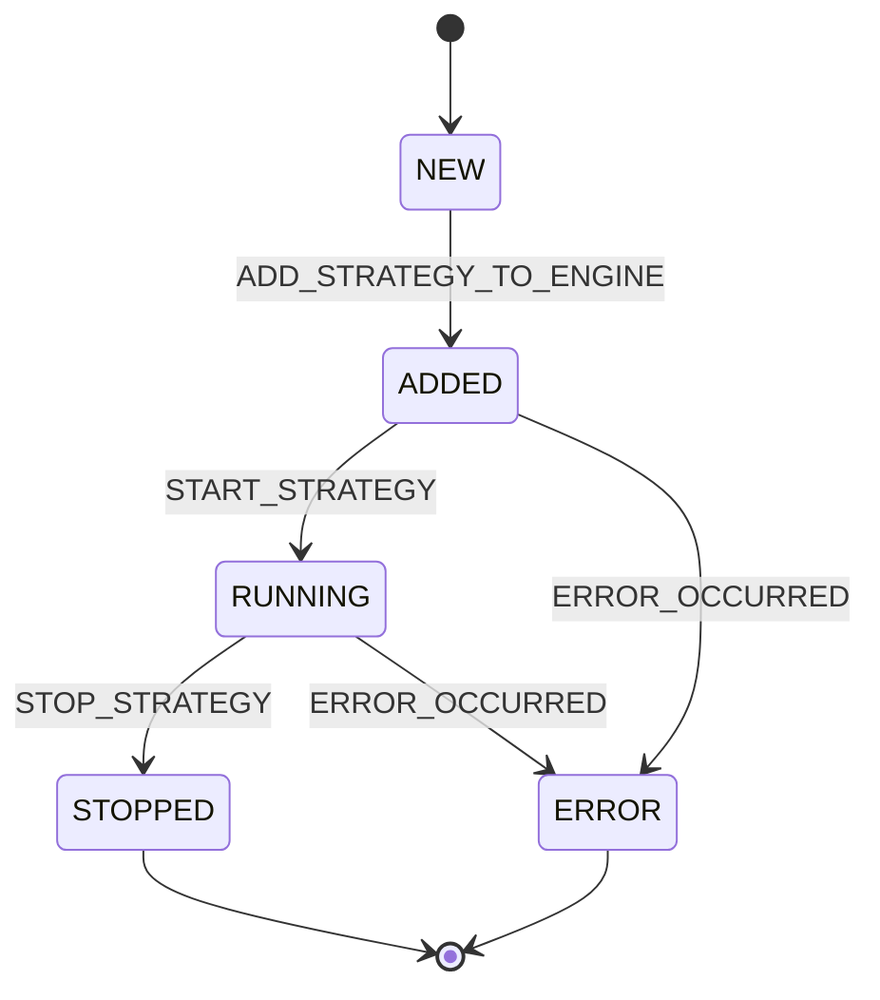

# SUITE Trading

SUITE stands for: **S**imple, **U**nderstandable, **I**ntuitive **T**rading **E**ngine

SUITE Trading is a **modern Python framework for algorithmic trading**, which provides unified, event-driven architecture for backtesting, paper trading and live trading. It is designed to make you productive quickly.

  [](https://deepwiki.com/stefansimik/suite_trading)

> Work in progress: SUITE Trading is under active development. Breaking changes may happen while the API stabilizes.

---

## What can you do with SUITE Trading?

- **Backtest your trading ideas** — Test strategies on historical data before risking real money
- **Paper trade** — Run strategies in real-time with simulated money to validate your approach
- **Go live** — Deploy the same strategy code to real brokers when you're ready
- **Run multiple strategies together** — Test how strategies interact when sharing the same timeline

**Who is this for?** Developers and traders who want a clean, understandable framework without hidden magic. If you've been frustrated by complex trading libraries where you can't follow what's happening, SUITE Trading is for you.

---

## Key Features

- **One codebase, multiple modes**: Same strategy code runs in backtesting, paper trading, and live trading
- **Shared timeline simulation**: Multiple strategies run together on one shared clock with predictable event ordering
- **Simple, intuitive API**: Domain model matches how traders think — `Order`, `Position`, `Bar`, `OrderBook` behave as expected
- **Smart components with clear jobs**: Each piece has one responsibility and they connect explicitly
- **Realistic simulation (alpha)**: SimBroker supports MARKET, LIMIT, STOP, STOP_LIMIT orders plus margin, fees, slippage
- **Extensible by design**: Plug in new data sources, broker adapters, and event types with minimal code
- **Modern Python**: Typed Python 3.13+ for strong IDE support and safe refactoring

---

## Quick Start (30 seconds)

### Install and run your first backtest

```bash
# Clone the repository
git clone https://github.com/stefansimik/suite_trading
cd suite_trading

# Install dependencies
uv sync

# Run a working example
uv run examples/minimal_strategy.py
```

**What you'll see:**
```
INFO:__main__:Strategy finished after 20 bars
```

That's it! You just ran a complete backtest. The example strategy bought on bar 1, sold on bar 6, and processed 20 bars of synthetic data.

---

## Table of Contents

- [What can you do with SUITE Trading?](#what-can-you-do-with-suite-trading)
- [Quick Start (30 seconds)](#quick-start-30-seconds)
- [Your First Strategy (5 minutes)](#your-first-strategy-5-minutes)
- [Core Concepts (10 minutes)](#core-concepts-10-minutes)
- [Going Deeper](#going-deeper)
- [Extending the Framework](#extending-the-framework)
- [Key Features](#key-features)
- [Installation](#installation)
- [Roadmap](#roadmap)
- [Project Info](#project-info)
- [Contributing](#contributing)
- [License](#license)
- [Disclaimer](#disclaimer)

---

## Your First Strategy (5 minutes)

Let's understand what the Quick Start example does. Here's the complete strategy:

```python
from decimal import Decimal
from suite_trading.broker.simbroker import SimBroker
from suite_trading.core.engine import TradingEngine
from suite_trading.core.strategy import Strategy
from suite_trading.domain.event import Event, BarEvent
from suite_trading.domain.order import MarketOrder, OrderSide
from suite_trading.event_feed.fixed_sequence_event_feed import FixedSequenceEventFeed
from suite_trading.utils.data_generation.assistant import DGA
from suite_trading.utils.event_tools import wrap_bars_to_events


class DemoStrategy(Strategy):
    """Buys on the first bar and sells 5 bars later."""

    def __init__(self, name: str, broker: SimBroker) -> None:
        super().__init__(name)
        self._broker = broker
        self._bar_count = 0

    def on_start(self) -> None:
        # Create 20 synthetic bars and feed them to this strategy
        bars = DGA.bars.create_bar_series(num_bars=20)
        bars_event_feed = FixedSequenceEventFeed(wrap_bars_to_events(bars))
        self.add_event_feed("bars", bars_event_feed, use_for_simulated_fills=True)

    def on_event(self, event: Event) -> None:
        if isinstance(event, BarEvent):
            self.on_bar(event.bar)

    def on_bar(self, bar) -> None:
        self._bar_count += 1

        # Buy on bar 1
        if self._bar_count == 1:
            order = MarketOrder(instrument=bar.instrument, side=OrderSide.BUY, quantity=Decimal("1"))
            self.submit_order(order, self._broker)

        # Sell on bar 6
        if self._bar_count == 6:
            order = MarketOrder(instrument=bar.instrument, side=OrderSide.SELL, quantity=Decimal("1"))
            self.submit_order(order, self._broker)


def run() -> None:
    # 1. Create the engine (orchestrates everything)
    engine = TradingEngine()

    # 2. Create a simulated broker (handles orders and fills)
    sim_broker = SimBroker()
    engine.add_broker("sim", sim_broker)

    # 3. Create your strategy and connect it to the broker
    strategy = DemoStrategy(name="demo_strategy", broker=sim_broker)
    engine.add_strategy(strategy)

    # 4. Start! (blocks until all data is processed)
    engine.start()


if __name__ == "__main__":
    run()
```

See the full runnable script: [`examples/minimal_strategy.py`](examples/minimal_strategy.py)

### What happens step by step

1. **TradingEngine starts** — It's the conductor that keeps everything in sync
2. **Strategy.on_start() runs** — Your strategy creates 20 synthetic bars and attaches them as data
3. **Bars arrive one by one** — Each bar triggers `on_event()`, then `on_bar()`
4. **Bar 1: Buy order** — Strategy submits a market order, SimBroker simulates the fill
5. **Bar 6: Sell order** — Strategy closes the position
6. **Bars 7-20: Just watching** — Strategy receives bars but takes no action
7. **Done** — All data processed, engine stops automatically

### The four building blocks

Every SUITE Trading program uses these four pieces:

| Component | What it does | Your job |
|-----------|--------------|----------|
| **TradingEngine** | Runs the clock, routes events | Create it, add strategies and brokers |
| **Strategy** | Your trading logic | Write `on_event()` to react to data |
| **Broker** | Handles orders and positions | Use `SimBroker` for testing, real broker for live |
| **EventFeed** | Brings in market data | Attach data sources in `on_start()` |

---

## Core Concepts (10 minutes)

Now that you've seen a working example, let's understand each piece better.

### TradingEngine — The Conductor

**What it is:** The central coordinator that runs your strategies on a shared timeline.

**Why it matters:** When you run multiple strategies together, they all see events in the same order. Strategy A can't accidentally see "future" data that Strategy B hasn't seen yet.

```python
engine = TradingEngine()
engine.add_broker("sim", SimBroker())
engine.add_strategy(my_strategy)
engine.start()  # Blocks until finished
```

**What it manages:**
- All your strategies
- All your brokers
- The current simulation time
- Event routing between components

### Strategy — Your Trading Logic

**What it is:** A class where you write your trading decisions.

**Why it matters:** You focus on *what* to trade and *when*. The framework handles the plumbing.

```python
class MyStrategy(Strategy):
    def on_start(self) -> None:
        # Set up data feeds here
        pass

    def on_event(self, event: Event) -> None:
        # React to market data here
        if isinstance(event, BarEvent):
            # Decide whether to buy/sell
            pass

    def on_stop(self) -> None:
        # Clean up here
        pass
```

**Key callbacks:**
- `on_start()` — Called once when strategy starts. Set up your data feeds here.
- `on_event(event)` — Called for every piece of market data. Your main logic goes here.
- `on_stop()` — Called once when strategy stops. Log results, clean up.
- `on_error(error)` — Called if something goes wrong.

### Broker and SimBroker — Order Handling

**What it is:** The interface between your strategy and the market.

**Why it matters:** `SimBroker` lets you test strategies without real money. When you're ready to go live, you swap it for a real broker adapter — your strategy code stays the same.

```python
# For backtesting and paper trading
sim_broker = SimBroker()

# Submit an order
order = MarketOrder(instrument=instrument, side=OrderSide.BUY, quantity=Decimal("1"))
self.submit_order(order, sim_broker)
```

**SimBroker simulates:**
- Order matching against market data
- Position tracking
- Account balance and margin
- Fees and slippage (configurable)

**One broker = one account.** If you need multiple accounts, create multiple broker instances.

### EventFeed — Data Input

**What it is:** How market data enters your strategy.

**Why it matters:** You can plug in any data source — historical files, databases, live feeds — using the same interface.

```python
def on_start(self) -> None:
    # Create bars and wrap them as events
    bars = DGA.bars.create_bar_series(num_bars=100)
    event_feed = FixedSequenceEventFeed(wrap_bars_to_events(bars))

    # Attach to this strategy
    self.add_event_feed("my_data", event_feed, use_for_simulated_fills=True)
```

**The `use_for_simulated_fills` parameter:**
- `True` — This data drives order matching in SimBroker
- `False` — Data goes to your strategy only (useful for signals that shouldn't affect fills)

### Event — Data Wrapper

**What it is:** A container for "something that happened at a time."

**Why it matters:** Everything in SUITE Trading is an event with timestamps. This keeps the timeline consistent.

**Built-in event types:**
- `BarEvent` — OHLC price bars
- `TradeTickEvent` — Individual trades
- `QuoteTickEvent` — Bid/ask quotes
- `OrderBookEvent` — Full order book snapshots

**Every event has two timestamps:**
- `dt_event` — When it happened in the market
- `dt_received` — When it entered our system

Both must be timezone-aware UTC. The framework will reject naive datetimes to catch data issues early.

---

## Going Deeper

### How SimBroker Matches Orders

When you submit an order, SimBroker needs market data to simulate fills. Here's how different data types work:

| Data Type | Order Books Created | Realism Level |
|-----------|---------------------|---------------|
| `BarEvent` | 4 (open, high, low, close) | Basic |
| `TradeTickEvent` | 1 (bid=ask=trade price) | Better |
| `QuoteTickEvent` | 1 (best bid, best ask) | Good |
| `OrderBookEvent` | 1 (full depth) | Best |

**Tip:** Start with bars for quick testing. Use ticks or order books when you need realistic fill simulation.

### Architecture Overview

SUITE Trading uses an **event-driven architecture**. Data flows like this:



### Event Loop Detail

Here's what happens inside the engine on each iteration:



**Event ordering:**
- Primary sort is by `dt_event` (when it happened in the market)
- Secondary sort is by `dt_received` (when it entered the system) — this makes ordering predictable when two events share the same market timestamp

**Important:** The engine can only be as "time-ordered" as the feeds. For realistic runs, each EventFeed should emit events in non-decreasing `dt_event` order.

### Lifecycle States

**TradingEngine states:**



**Strategy states:**



---

## Extending the Framework

### Add a New EventFeed

Have data in CSV, Parquet, a database, or a live websocket? Create a custom EventFeed:

1. Implement the `EventFeed` protocol: `peek()`, `pop()`, `is_finished()`, `close()`
2. Convert your data into domain objects (bars, ticks, etc.)
3. Wrap them in `Event` objects with proper timestamps
4. Attach in `Strategy.on_start()` via `add_event_feed(...)`

### Add a New Broker

To trade live, create a broker adapter for your venue:

1. Implement the `Broker` protocol
2. Register with `engine.add_broker("my_broker", my_broker)`
3. Your strategies can now submit orders to it — same API as SimBroker

### Add Custom Event Types

Need news sentiment, funding rates, or on-chain data? Create custom events:

1. Define your payload object
2. Wrap it in an `Event` with timestamps
3. Emit from your `EventFeed`
4. Handle in `Strategy.on_event()`

---

## Installation

### Prerequisites

- **Python 3.13.x** (latest Python 3.14.x will be adopted ~6 months after release)
- **uv** package manager (recommended)
- Git

SUITE Trading runs on macOS, Linux, and Windows.

### Install

```bash
git clone https://github.com/stefansimik/suite_trading
cd suite_trading
uv sync
```

### Verify Installation

Run the integration tests to confirm everything works:

```bash
uv run pytest tests/integration/test_basic_flow.py -v
```

Or without uv:

```bash
python -m pytest tests/integration/test_basic_flow.py -v
```

For a richer demo with order submission:

```bash
uv run pytest tests/integration/test_two_trade_demo_strategy.py -v
```

Full test suite:

```bash
uv run pytest
```

---

## Roadmap

Roadmap last updated: `2025-12-17`

SUITE Trading is in active development with approximately **70% of core functionality** implemented.

| Status | Area         | Work item |
|:-------|:-------------|:---------|
| ✅      | Core         | Event-driven architecture with chronological processing. Stable event ordering on the shared timeline. |
| ✅      | Core         | TradingEngine with multi-strategy management. Deterministic processing across Strategy(ies). |
| ✅      | Strategy     | Strategy framework (on_start, on_stop, on_error, on_event). Core lifecycle and event routing. |
| ✅      | Domain       | Domain models: Event, Bar, Order, Instrument, Money, Position, Account. Core trading and market-data objects. |
| ✅      | Data         | EventFeed system with timeline filtering. Skip/trim past events to keep the timeline in sync. |
| ✅      | Simulation   | SimBroker order lifecycle (MARKET/LIMIT/STOP/STOP_LIMIT; cancel/modify). Base simulation in place; improving. |
| ✅      | Core         | MessageBus with topic-based routing and wildcards. Internal event routing backbone. |
| ✅      | Simulation   | Event → OrderBook conversion for order matching. Enables matching against order books. |
| ✅      | Accounting   | Per-instrument position tracking. Core position state per instrument. |
| ✅      | Reporting    | Per-strategy execution history. Raw execution data captured per Strategy. |
| ✅      | Productivity | Data generation utilities for testing. Synthetic fixtures for fast iteration. |
| ✅      | Simulation   | SimBroker realism layer (margin, fees, slippage, liquidity). Expand fill models and overall realism. |
| ✅      | Simulation   | Time-in-force semantics in SimBroker (IOC, FOK, DAY, GTD, GTC). Add TimeInForce rules; model GTD datetime if needed. |
| 🗓️    | Accounting   | Account correctness review (cash, margin, position lifecycle). Audit and tighten Account / SimAccount invariants. (Timeline: TBD) |
| 🗓️    | Orders       | Order relationships (OCO; define OUO semantics). Implement OCO first; specify OUO before adding more relationships. (Timeline: TBD) |
| 🗓️    | Orders       | OrderBuilder (safe, ergonomic order creation). Reduce boilerplate and centralize validation. (Timeline: TBD) |
| 🗓️    | Data         | CSV/Parquet event-feeds. High-performance data loading for backtests. (Timeline: Q2 2026) |
| 🗓️    | Indicators   | Indicators framework (SMA, EMA, RSI, MACD, ...). Common indicator set and clean Strategy API. (Timeline: TBD) |
| 🗓️    | Reporting    | Performance statistics per Strategy + backtest reports. Build metrics from executions/positions (portfolio analytics later). (Timeline: TBD) |
| 🗓️    | UI           | Streamlit export (bars, executions, equity curve, results). Export-friendly data for visualization. (Timeline: TBD) |
| 🗓️    | UI           | Dashboard. Monitoring and controls (local-first). (Timeline: Q4 2026) |
| 🗓️    | Strategy     | Strategy regression / extensibility review. Add more scenarios; consider plugins only if it reduces duplication. (Timeline: TBD) |
| 🗓️    | Live         | First live broker adapter: Interactive Brokers (IBKR). First real-money integration (single-account Broker adapter). (Timeline: Q3 2026) |

Legend:

- ✅ **Done**
- 🚧 **In progress**
- 🗓️ **Planned**

---

## Project Info

- **Version**: 0.0.1 (alpha)
- APIs may change; breaking changes are allowed while the design stabilizes.

---

## Contributing

1. Open an issue with what you want to change and why.
2. Keep PRs small and focused.
3. Add tests where behavior matters.

## License

MIT License. See the `LICENSE` file for details.

## Disclaimer

* This project is for educational and research purposes only.
* It is not financial advice.
* Trading involves risk and you can lose money.
