# SUITE Trading

SUITE stands for: **S**imple, **U**nderstandable, **I**ntuitive **T**rading **E**ngine

SUITE Trading is a **modern Python framework for algorithmic trading** that provides a unified, event-driven architecture for backtesting, paper trading, and live trading. It's designed to help you go from idea to execution quickly and confidently.

  [](https://deepwiki.com/stefansimik/suite_trading)

> ⚠️ **Work in progress:** SUITE Trading is under active development. Breaking changes may happen while the API stabilizes.

---

## What Can You Do with SUITE Trading?

- **Backtest your trading ideas** — Test strategies on historical data before risking real funds
- **Paper trade** — Run strategies in real-time with simulated funds to validate your approach
- **Go live** — Deploy the same strategy code to real brokers when you're ready
- **Run multiple strategies together** — Test how strategies interact when sharing the same timeline

**Who is this for?** Developers and traders who want a clean, understandable framework without hidden magic. If you've been frustrated by complex trading libraries where you can't follow what's happening, SUITE Trading is for you.

```mermaid
flowchart LR
    subgraph "Your Journey"
        A[💡 Trading Idea] --> B[📊 Backtest]
        B --> C[📝 Paper Trade]
        C --> D[💰 Live Trading]
    end

    style A fill:#e1f5fe
    style B fill:#fff3e0
    style C fill:#f3e5f5
    style D fill:#e8f5e9
```



---

## Key Features

| Feature | Description |
|---------|-------------|
| **One codebase, multiple modes** | Same strategy code runs in backtesting, paper trading, and live trading |
| **Shared timeline simulation** | Multiple strategies run together on one shared clock with predictable event ordering |
| **Simple, intuitive API** | Domain model matches how traders think — `Order`, `Position`, `Bar`, `OrderBook` behave as expected |
| **Smart components with clear jobs** | Each piece has one responsibility and they connect explicitly |
| **Realistic simulation** | SimBroker supports MARKET, LIMIT, STOP, STOP_LIMIT orders plus margin, fees, slippage |
| **Extensible by design** | Plug in new data sources, broker adapters, and event types with minimal code |
| **Modern Python** | Typed Python 3.13+ for strong IDE support and safe refactoring |

---

## Quick Start (30 seconds)

### Install and Run Your First Backtest

```bash
# Clone the repository
git clone https://github.com/stefansimik/suite_trading
cd suite_trading

# Install dependencies
uv sync

# Run a working example
uv run examples/minimal_strategy.py
```

**What you'll see:**
```
INFO:__main__:Strategy finished after 20 bars
```

🎉 **That's it!** You just ran a complete backtest. The example strategy bought on bar 1, sold on bar 6, and processed 20 bars of synthetic data.

---

## Table of Contents

- [What Can You Do with SUITE Trading?](#what-can-you-do-with-suite-trading)
- [Key Features](#key-features)
- [Quick Start (30 seconds)](#quick-start-30-seconds)
- [Your First Strategy (5 minutes)](#your-first-strategy-5-minutes)
- [Core Concepts (10 minutes)](#core-concepts-10-minutes)
- [Going Deeper](#going-deeper)
- [Extending the Framework](#extending-the-framework)
- [Installation](#installation)
- [Roadmap](#roadmap)
- [Project Info](#project-info)
- [Contributing](#contributing)
- [License](#license)
- [Disclaimer](#disclaimer)

---

## Your First Strategy (5 minutes)

Let's understand what the Quick Start example does. Here's the strategy from [`examples/minimal_strategy.py`](examples/minimal_strategy.py):

```python
class DemoStrategy(Strategy):
    """Buys on the first bar and sells 5 bars later."""

    def __init__(self, name: str, broker: Broker) -> None:
        super().__init__(name)
        self._broker = broker
        self._bar_count = 0

    def on_start(self) -> None:
        # Create 20 synthetic bars and feed them to this strategy
        bars = DGA.bar.create_series(num_bars=20)
        bars_event_feed = FixedSequenceEventFeed(wrap_bars_to_events(bars))
        self.add_event_feed("bars", bars_event_feed, use_for_simulated_fills=True)

    def on_event(self, event: Event) -> None:
        if isinstance(event, BarEvent):
            self.on_bar(event.bar)

    def on_bar(self, bar: Bar) -> None:
        self._bar_count += 1

        # Buy on bar 1
        if self._bar_count == 1:
            order = MarketOrder(instrument=bar.instrument, side=OrderSide.BUY, quantity=Decimal("1"))
            self.submit_order(order, self._broker)

        # Sell on bar 6
        if self._bar_count == 6:
            order = MarketOrder(instrument=bar.instrument, side=OrderSide.SELL, quantity=Decimal("1"))
            self.submit_order(order, self._broker)

    def on_stop(self) -> None:
        logger.info(f"Strategy finished after {self._bar_count} bars")


def run() -> None:
    # 1. Create the engine (coordinates everything)
    engine = TradingEngine()

    # 2. Create a simulated broker (handles orders and fills)
    sim_broker = SimBroker()
    engine.add_broker("sim", sim_broker)

    # 3. Create your strategy and connect it to the broker
    strategy = DemoStrategy(name="demo_strategy", broker=sim_broker)
    engine.add_strategy(strategy)

    # 4. Start! (blocks until all data is processed)
    engine.start()
```

📄 **Full runnable script with imports:** [`examples/minimal_strategy.py`](examples/minimal_strategy.py)

### What Happens Step by Step


**In plain English:**

1. **TradingEngine starts** — It's the coordinator that keeps everything in sync
2. **Strategy.on_start() runs** — Your strategy creates 20 synthetic bars and attaches them as data
3. **Bars arrive one by one** — Each bar triggers `on_event()`, then `on_bar()`
4. **Bar 1: Buy order** — Strategy submits a market order, SimBroker simulates the fill
5. **Bar 6: Sell order** — Strategy closes the position
6. **Bars 7-20: Just watching** — Strategy receives bars but takes no action
7. **Done** — All data processed, engine stops automatically

### The Four Building Blocks

Every SUITE Trading program uses these four pieces:

```mermaid
flowchart TB
    subgraph "The Four Building Blocks"
        Engine[🎯 TradingEngine<br/>The Conductor]
        Strategy[🧠 Strategy<br/>Your Trading Logic]
        Broker[💼 Broker<br/>Order Handler]
        Feed[📈 EventFeed<br/>Data Source]
    end

    Feed -->|market data| Engine
    Engine -->|events| Strategy
    Strategy -->|orders| Broker
    Broker -->|fills & updates| Engine

    style Engine fill:#e3f2fd
    style Strategy fill:#fff8e1
    style Broker fill:#f3e5f5
    style Feed fill:#e8f5e9
```



| Component | What It Does | Your Job |
|-----------|--------------|----------|
| **TradingEngine** | Runs the clock, routes events | Create it, add strategies and brokers |
| **Strategy** | Your trading logic | Write `on_event()` to react to data |
| **Broker** | Handles orders and positions | Use `SimBroker` for testing, real broker for live |
| **EventFeed** | Brings in market data | Attach data sources in `on_start()` |

---

## Core Concepts (10 minutes)

Now that you've seen a working example, let's understand each piece better.

### TradingEngine — The Conductor

**What it is:** The central coordinator that runs your strategies on a shared timeline.

**Why it matters:** When you run multiple strategies together, they all see events in the same order. Strategy A can't accidentally see "future" data that Strategy B hasn't seen yet. This is crucial for realistic backtesting.

```python
from suite_trading.platform.engine.trading_engine import TradingEngine
from suite_trading.platform.broker.sim.sim_broker import SimBroker

engine = TradingEngine()
engine.add_broker("sim", SimBroker())
engine.add_strategy(my_strategy)
engine.start()  # Blocks until finished
```

**What it manages:**
- ✅ All your strategies
- ✅ All your brokers
- ✅ The current simulation time
- ✅ Event routing between components

### Strategy — Your Trading Logic

**What it is:** A class where you write your trading decisions.

**Why it matters:** You focus on *what* to trade and *when*. The framework handles the plumbing.

```python
from suite_trading.strategy.strategy import Strategy
from suite_trading.domain.event import Event
from suite_trading.domain.market_data.bar.bar_event import BarEvent

class MyStrategy(Strategy):
    def on_start(self) -> None:
        # Set up data feeds here
        pass

    def on_event(self, event: Event) -> None:
        # React to market data here
        if isinstance(event, BarEvent):
            # Decide whether to buy/sell
            pass

    def on_stop(self) -> None:
        # Clean up here
        pass
```

**Key callbacks:**

| Callback | When It's Called | What to Do Here |
|----------|------------------|-----------------|
| `on_start()` | Once when strategy starts | Set up your data feeds |
| `on_event(event)` | For every piece of market data | Your main trading logic |
| `on_stop()` | Once when strategy stops | Log results, clean up |
| `on_error(error)` | If something goes wrong | Handle errors gracefully |

### Broker and SimBroker — Order Handling

**What it is:** The interface between your strategy and the market.

**Why it matters:** `SimBroker` lets you test strategies without real funds. When you're ready to go live, you swap it for a real broker adapter — your strategy code stays the same.

```python
from suite_trading.platform.broker.sim.sim_broker import SimBroker
from suite_trading.domain.order.orders import MarketOrder
from suite_trading.domain.order.order_enums import OrderSide
from decimal import Decimal

# For backtesting and paper trading
sim_broker = SimBroker()

# Submit an order
order = MarketOrder(instrument=instrument, side=OrderSide.BUY, quantity=Decimal("1"))
self.submit_order(order, sim_broker)
```

**SimBroker simulates:**
- ✅ Order matching against market data
- ✅ Position tracking
- ✅ Account balance and margin
- ✅ Fees and slippage (configurable)

> 💡 **Important:** One broker = one account. If you need multiple accounts, create multiple broker instances.

### EventFeed — Data Input

**What it is:** How market data enters your strategy.

**Why it matters:** You can plug in any data source — historical files, databases, live feeds — using the same interface.

```python
from suite_trading.platform.event_feed.fixed_sequence_event_feed import FixedSequenceEventFeed
from suite_trading.domain.market_data.bar.bar_event import wrap_bars_to_events
from suite_trading.utils.data_generation.assistant import DGA


def on_start(self) -> None:
    # Create bars and wrap them as events
    bars = DGA.bar.create_series(num_bars=100)
    event_feed = FixedSequenceEventFeed(wrap_bars_to_events(bars))

    # Attach to this strategy
    self.add_event_feed("my_data", event_feed, use_for_simulated_fills=True)
```

**The `use_for_simulated_fills` parameter:**
- `True` — This data drives order matching in SimBroker (use for your main price data)
- `False` — Data goes to your strategy only (useful for signals, indicators, or reference data that shouldn't affect fills)

### Event — Data Wrapper

**What it is:** A container for "something that happened at a specific time."

**Why it matters:** Everything in SUITE Trading is an event with timestamps. This keeps the timeline consistent and makes the system predictable.

**Built-in event types:**

| Event Type | What It Contains | Use Case |
|------------|------------------|----------|
| `BarEvent` | OHLC price bars | Most common for backtesting |
| `TradeTickEvent` | Individual trades | High-frequency strategies |
| `QuoteTickEvent` | Bid/ask quotes | Spread analysis, market making |
| `OrderBookEvent` | Full order book snapshots | Depth analysis, realistic fills |

**Every event has two timestamps:**

| Timestamp | Meaning |
|-----------|---------|
| `dt_event` | When it happened in the market |
| `dt_received` | When it entered our system |

> ⚠️ Both timestamps must be **timezone-aware UTC**. The framework will reject naive datetimes to catch data issues early.

---

## Going Deeper

### How SimBroker Matches Orders

When you submit an order, SimBroker needs market data to simulate fills. Here's how different data types work:

```mermaid
flowchart LR
    subgraph "Data Quality → Fill Realism"
        Bar[📊 BarEvent<br/>4 order books]
        Trade[📍 TradeTickEvent<br/>1 order book]
        Quote[💬 QuoteTickEvent<br/>1 order book]
        Book[📚 OrderBookEvent<br/>1 order book]
    end

    Bar -.->|Basic| Realism
    Trade -.->|Better| Realism
    Quote -.->|Good| Realism
    Book -.->|Best| Realism

    Realism[🎯 Fill Realism]

    style Bar fill:#ffecb3
    style Trade fill:#fff9c4
    style Quote fill:#c8e6c9
    style Book fill:#a5d6a7
```



| Data Type | Order Books Created | Realism Level | Best For |
|-----------|---------------------|---------------|----------|
| `BarEvent` | 4 (open, high, low, close) | Basic | Quick testing, daily strategies |
| `TradeTickEvent` | 1 (bid=ask=trade price) | Better | Intraday strategies |
| `QuoteTickEvent` | 1 (best bid, best ask) | Good | Spread-sensitive strategies |
| `OrderBookEvent` | 1 (full depth) | Best | HFT, market making |

> 💡 **Tip:** Start with bars for quick testing. Use ticks or order books when you need realistic fill simulation.

### Architecture Overview

SUITE Trading uses an **event-driven architecture**. Data flows through the system like this:

```mermaid
flowchart TB
    subgraph "Data Sources"
        EF1[EventFeed 1<br/>Historical Bars]
        EF2[EventFeed 2<br/>Live Quotes]
        EF3[EventFeed N<br/>Custom Data]
    end

    subgraph "Core Engine"
        Engine[TradingEngine<br/>🎯 Orchestrator]
        Timeline[Shared Timeline<br/>⏰ Single Clock]
    end

    subgraph "Your Logic"
        S1[Strategy A]
        S2[Strategy B]
    end

    subgraph "Brokers"
        B1[SimBroker<br/>📊 Simulation]
        B2[Live Broker<br/>💰 Real Trading]
    end

    EF1 --> Engine
    EF2 --> Engine
    EF3 --> Engine

    Engine --> Timeline
    Timeline --> S1
    Timeline --> S2

    S1 -->|orders| B1
    S2 -->|orders| B1
    S1 -.->|orders| B2
    S2 -.->|orders| B2

    B1 -->|fills| Engine
    B2 -.->|fills| Engine

    style Engine fill:#e3f2fd
    style Timeline fill:#fff8e1
    style B1 fill:#f3e5f5
    style B2 fill:#e8f5e9
```



### Event Loop Detail

Here's what happens inside the engine on each iteration:


**Event ordering:**
- **Primary sort:** `dt_event` (when it happened in the market)
- **Secondary sort:** `dt_received` (when it entered the system) — this makes ordering predictable when two events share the same market timestamp

> ⚠️ **Important:** The engine can only be as "time-ordered" as the feeds. For realistic runs, each EventFeed should emit events in non-decreasing `dt_event` order.

### Lifecycle States

Understanding the state machines helps you debug issues and write robust strategies.

**TradingEngine states:**


**Strategy states:**


---

## Extending the Framework

SUITE Trading is designed to be extended. Here's how to add your own components.

```mermaid
flowchart LR
    subgraph "Extension Points"
        EF[📈 Custom EventFeed<br/>Your data sources]
        BR[💼 Custom Broker<br/>Your trading venue]
        EV[📦 Custom Events<br/>Your data types]
    end

    subgraph "Framework"
        Engine[TradingEngine]
        Strategy[Your Strategy]
    end

    EF --> Engine
    BR --> Engine
    EV --> Engine
    Engine --> Strategy

    style EF fill:#e8f5e9
    style BR fill:#f3e5f5
    style EV fill:#fff8e1
```



### Add a New EventFeed

Have data in CSV, Parquet, a database, or a live websocket? Create a custom EventFeed:

1. **Implement the `EventFeed` protocol:** `peek()`, `pop()`, `is_finished()`, `close()`
2. **Convert your data** into domain objects (bars, ticks, etc.)
3. **Wrap them in `Event` objects** with proper timestamps
4. **Attach in `Strategy.on_start()`** via `add_event_feed(...)`

### Add a New Broker

To trade live, create a broker adapter for your venue:

1. **Implement the `Broker` protocol**
2. **Register with the engine:** `engine.add_broker("my_broker", my_broker)`
3. **Submit orders** — your strategies use the same API as SimBroker

### Add Custom Event Types

Need news sentiment, funding rates, or on-chain data? Create custom events:

1. **Define your payload object**
2. **Wrap it in an `Event`** with timestamps
3. **Emit from your `EventFeed`**
4. **Handle in `Strategy.on_event()`**

---

## Installation

### Prerequisites

| Requirement | Details |
|-------------|---------|
| **Python** | 3.13.x (Python 3.14.x will be adopted ~6 months after release) |
| **Package Manager** | [uv](https://docs.astral.sh/uv/getting-started/installation/) (recommended) |
| **Git** | For cloning the repository |

SUITE Trading runs on **macOS**, **Linux**, and **Windows**.

### Install

```bash
git clone https://github.com/stefansimik/suite_trading
cd suite_trading
uv sync
```

### Verify Installation

Run the integration tests to confirm everything works:

```bash
uv run pytest tests/integration/test_basic_flow.py -v
```

Or without uv:

```bash
python -m pytest tests/integration/test_basic_flow.py -v
```

For a richer demo with order submission:

```bash
uv run pytest tests/integration/test_two_trade_demo_strategy.py -v
```

Full test suite:

```bash
uv run pytest
```

---

## Roadmap

**Last updated:** 2025-12-17

SUITE Trading is in active development with approximately **70% of core functionality** implemented.

### ✅ Completed

| Area | Feature |
|------|---------|
| **Core** | Event-driven architecture with chronological processing and stable event ordering |
| **Core** | TradingEngine with multi-strategy management and deterministic processing |
| **Core** | MessageBus with topic-based routing and wildcards |
| **Strategy** | Strategy framework (`on_start`, `on_stop`, `on_error`, `on_event`) with lifecycle management |
| **Domain** | Domain models: Event, Bar, Order, Instrument, Money, Position, Account |
| **Data** | EventFeed system with timeline filtering (skip/trim past events) |
| **Simulation** | SimBroker order lifecycle (MARKET/LIMIT/STOP/STOP_LIMIT; cancel/modify) |
| **Simulation** | Event → OrderBook conversion for order matching |
| **Simulation** | Realism layer (margin, fees, slippage, liquidity models) |
| **Simulation** | Time-in-force semantics (IOC, FOK, DAY, GTD, GTC) |
| **Accounting** | Per-instrument position tracking |
| **Reporting** | Per-strategy order fill history |
| **Productivity** | Data generation utilities for testing |

### 🗓️ Planned

| Area | Feature | Timeline |
|------|---------|----------|
| **Accounting** | Account correctness review (cash, margin, position lifecycle) | TBD |
| **Orders** | Order relationships (OCO; define OUO semantics) | TBD |
| **Orders** | OrderBuilder (safe, ergonomic order creation) | TBD |
| **Data** | CSV/Parquet event-feeds for high-performance data loading | Q2 2026 |
| **Indicators** | Indicators framework (SMA, EMA, RSI, MACD, ...) | TBD |
| **Reporting** | Performance statistics per Strategy + backtest reports | TBD |
| **UI** | Streamlit export (bars, order fills, equity curve, results) | TBD |
| **UI** | Dashboard for monitoring and controls | Q4 2026 |
| **Strategy** | Strategy regression / extensibility review | TBD |
| **Live** | First live broker adapter: Interactive Brokers (IBKR) | Q3 2026 |

### Legend

| Symbol | Meaning |
|--------|---------|
| ✅ | Done |
| 🚧 | In progress |
| 🗓️ | Planned |

---

## Project Info

| | |
|---|---|
| **Version** | 0.0.1 (alpha) |
| **Status** | Active development |
| **API Stability** | Breaking changes allowed while design stabilizes |

---

## Contributing

We welcome contributions! Here's how to get started:

1. **Open an issue** with what you want to change and why
2. **Keep PRs small** and focused on one thing
3. **Add tests** where behavior matters

---

## License

MIT License. See the [`LICENSE`](LICENSE) file for details.

---

## Disclaimer

> ⚠️ **Important:**
>
> - This project is for **educational and research purposes only**
> - It is **not financial advice**
> - Trading involves risk and **you can lose funds**
> - Always test thoroughly before using any trading system with real funds
